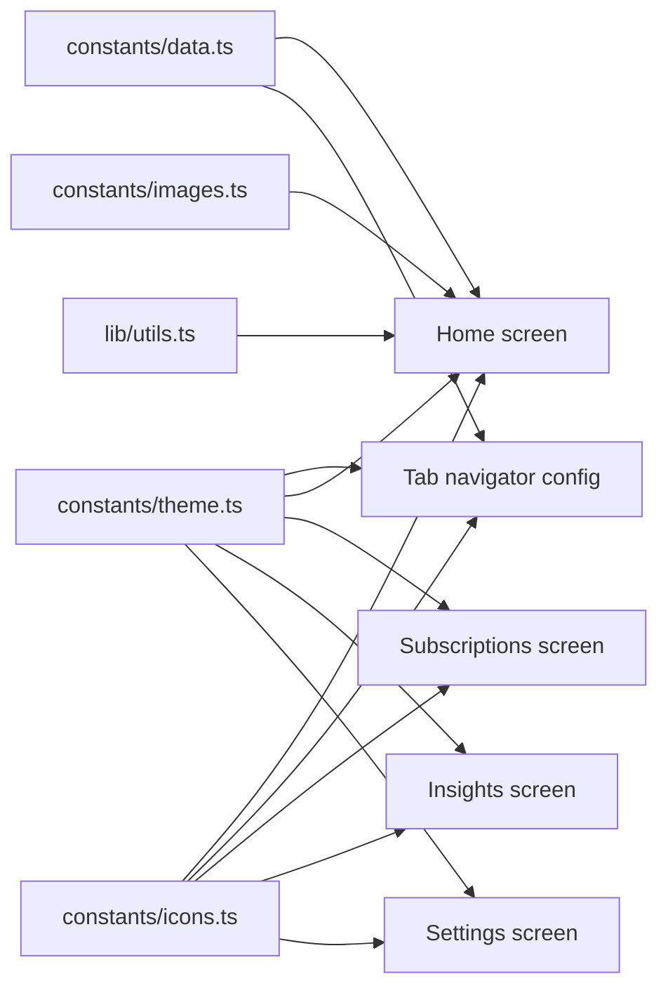

# Component Interaction Map

This file gives you a simple visual model of the app structure, screens, and shared dependencies.

## Route and screen flow

```mermaid
flowchart TD
    A[app/_layout.tsx<br/>RootLayout] --> B[Expo Router Stack]
    B --> C[app/onboarding.tsx]
    B --> D[app/(auth)/_layout.tsx]
    B --> E[app/(tabs)/_layout.tsx]

    D --> F[app/(auth)/sign-in.tsx]
    D --> G[app/(auth)/sign-up.tsx]
    F --> G
    G --> F

    E --> H[app/(tabs)/index.tsx<br/>Home]
    E --> I[app/(tabs)/subscriptions.tsx]
    E --> J[app/(tabs)/insights.tsx]
    E --> K[app/(tabs)/settings.tsx]

    H --> L[constants/data.ts]
    H --> M[constants/icons.ts]
    H --> N[constants/images.ts]
    H --> O[lib/utils.ts]
    H --> P[constants/theme.ts]

    E --> P
    I --> P
    J --> P
    K --> P
```

## Shared data and styling dependencies



## What interacts with what

- Root layout owns the overall router shell and decides whether the app shows onboarding, auth, or tab screens.
- The auth layout hosts sign-in and sign-up screens and links them together with Expo Router links.
- The tabs layout creates the bottom navigation and renders the four main tab screens.
- The home screen is the most connected screen because it pulls from data, icons, images, theme, and utilities.
- The other tab screens are currently simpler placeholders, but they still share the same theme and tab navigator styling.
